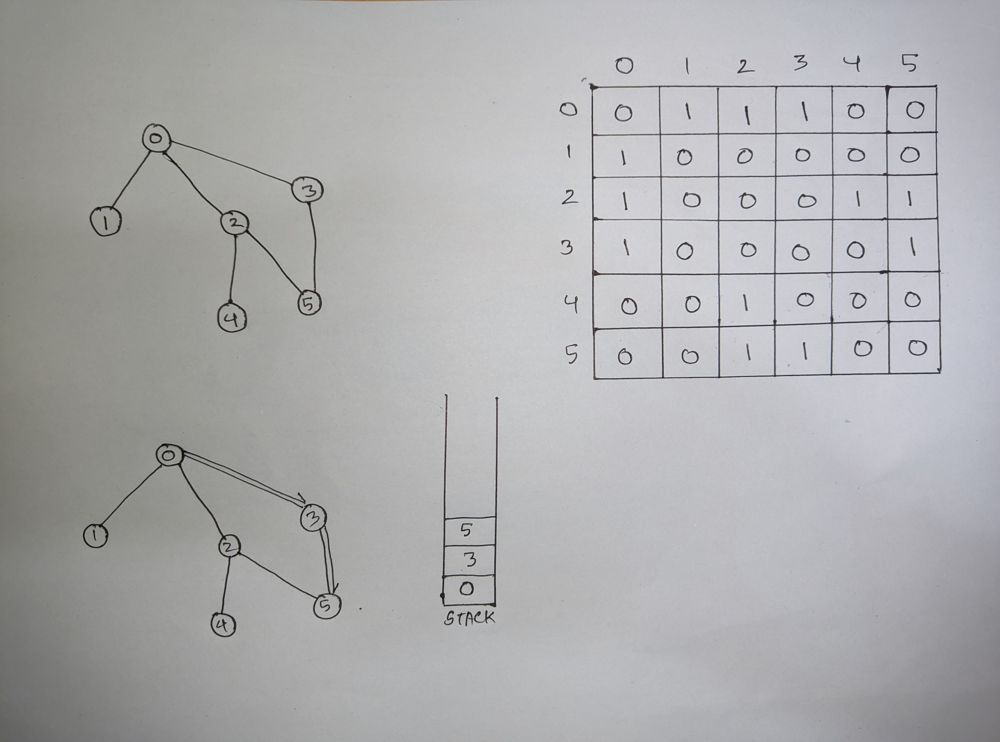
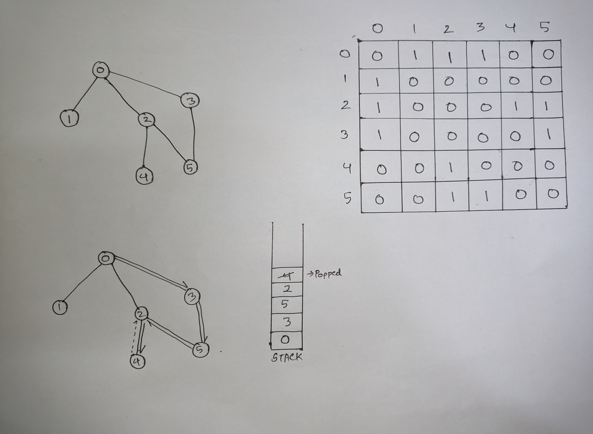
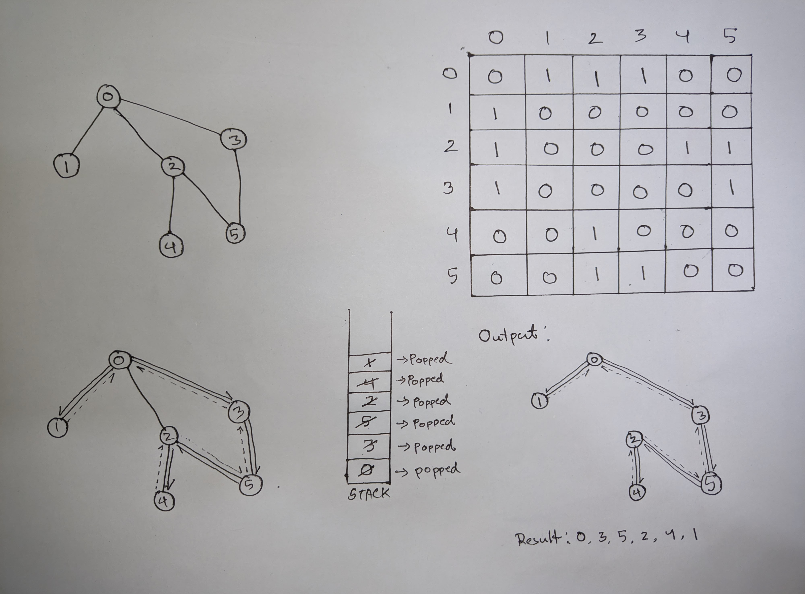

# DFS Algorithm and Steps 

### Depth First Search ( DFS ): Algorithm

### Depth First Search ( DFS ): Procedure

Let's consider the following graph to understand DFS traversal. 

Now we need to generate an input for the code. We can create an adjacency matrix from this graph.

## Step 1:
In this case we can start the traversal from node "0". We need to define a stack to track the nodes.

<ul>
  <li>First put the first node (in this case 0) to the stack. </li>
  <li>Then check if there are any adjacent nodes.</li>
</ul>

## Step 2:

We found 3 adjacent nodes here 1, 2 and 3. 

<ul>
  <li>Now push anyone of these nodes to the stack (In this case 3). </li>
  <li>Then check if there are any adjacent nodes of the current node (of node 3).</li>
</ul>

## Step 3:

Keep repeating this process untill there are no adjacent node of the current node.

<ul>
  <li>Here node "4" has no adjacent node. So we will pop it out of the stack to check the previous node.</li>
  <li>If the previous node has an adjacent node push it in the stack or pop the current node out of stack until any unvisited node is found</li>
</ul>

## Step 4:

Keep repating step 2 and step 3 until the stack is empty.

## Step 5:

Now the output is generated and it represents a spanning tree.

And the DFS output starting from node "0" is: 0, 3, 5, 2, 4, 1

** Output of the Code:

